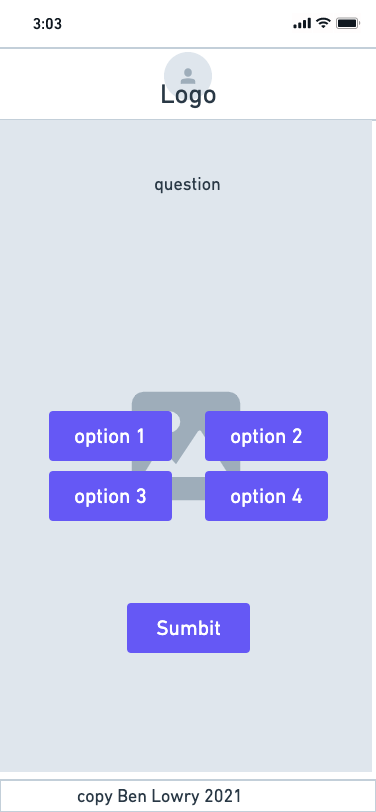
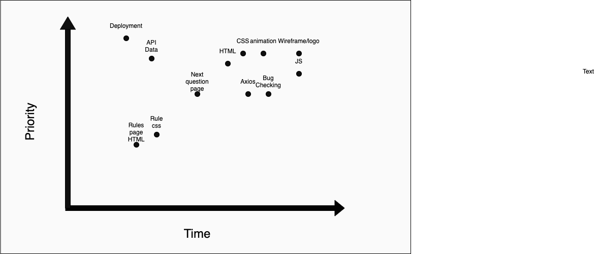

# QUIZ-ard

# Project Overview

## Project Name

QUIZ-ard

## Project Description

An RPG browser game that uses the open trivia API to show you a quiz question at random with clues, you start every wrong answer you loose a health point, but if you answer correctly you get a new item (clue counter) and show you a new trivia question - if you run out of health points, you lose but if you defeat the time "QUIZ-ard" you win the game!
more in (game_rules_and_sudo_code.md)

## API and Data Sample

jersevice: http://jservice.io/

......Jservice json......

```
  {
    "id": 28079,
    "answer": "gerrymandering",
    "question": "North Carolina's long, meandering \"I-85 District\" has been called an example of this tactic named for a politician",
    "value": 500,
    "airdate": "1999-07-05T12:00:00.000Z",
    "created_at": "2014-02-11T23:02:33.156Z",
    "updated_at": "2014-02-11T23:02:33.156Z",
    "category_id": 3141,
    "game_id": null,
    "invalid_count": null,
    "category": {
      "id": 3141,
      "title": "congressional districts",
      "created_at": "2014-02-11T23:02:32.637Z",
      "updated_at": "2014-02-11T23:02:32.637Z",
      "clues_count": 20
    }
  }
```

## Wireframes





#### MVP

- create the HTML/CSS/Javascript for user interfaces and query and then display the question on the page
- Axios call on Trivia/jservice API
- Display answer correct or not
- Display next button
- Allow use to type answer and recieve correct or incorrect and show the right answer and or multiple choice

#### PostMVP

- add second API for animations and art assets
- Use local storage to save user questions right or wrong for "items"(clues)

## Priority Matrix



## Timeframes

| Component             | Priority | Estimated Time | Time Invested | Actual Time |
| --------------------- | :------: | :------------: | :-----------: | :---------: |
| Initial HTML          |    M     |      3hrs      |       0       |      0      |
| Axios Call            |    H     |      3hrs      |     4hrs      |    4hrs     |
| API rendering         |    H     |      2hrs      |       0       |      0      |
| JS                    |    M     |      2hrs      |       0       |      0      |
| General stylingCSS    |    H     |      2hrs      |       0       |      0      |
| Bug checking          |    H     |      2hrs      |       0       |      0      |
| buttons               |    H     |      2hrs      |       0       |      0      |
| next question page    |    H     |      2hrs      |       0       |      0      |
| second api            |    l     |      2hrs      |       0       |      0      |
| animation             |    H     |      3hrs      |       0       |      0      |
| deployment            |    H     |     2.5hr      |       0       |      0      |
| how to play page html |    l     |     2.5hr      |       0       |      0      |
| how to play css       |    l     |      2hrs      |       0       |      0      |
| Wireframe/logo        |    l     |      2hrs      |       0       |      0      |
| Total                 |    l     |     34hrs      |     4hrs      |    4hrs     |
